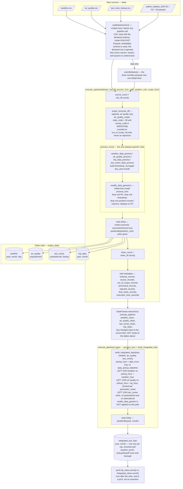

# Architecture Diagram

Diagram of the data platform implemented in `data_ingestion.py`. Nesting in the diagram
mirrors nesting in the code: `execute_pipeline` is the outer orchestrator, it calls
`process_func`, and `process_func` calls `modify_data_generic` itself. `readDataGeneric`
runs before any of that, at module level.

## Reading the diagram

- **Read happens outside the pipeline.** `readDataGeneric` is called at module level for all
  four sources before `execute_pipeline` runs. Schema validation is asymmetric: the three CSVs
  are read with the declared schema under `mode="FAILFAST"`, so a mismatch aborts ingestion,
  while the parquet branch ignores the declared schema entirely — so `trips_schema` is never
  enforced and the largest dataset is the least validated. Name normalization is
  `lower()` plus spaces-to-underscores, which lowercases `PULocationID` to `pulocationid`
  rather than splitting it into words.
- **`execute_pipeline` wraps everything else.** It counts the source, optionally narrows it
  with `scope_func`, calls `process_func`, writes Delta, counts the result and emits metadata.
  Only air quality passes a `scope_func`; its 8,087,666 out-of-region rows are reported as
  `out_of_scope_records` so they never look like data-quality failures.
- **The dataset-specific layer is one function deep.** `process_func` is the only code that
  differs per dataset — it builds the timestamp and the key, then calls the generic
  `modify_data_generic` itself. That is why `modify_data_generic` is drawn inside
  `process_func` rather than after it.
- **The integration pass reuses the same orchestrator.** `build_integrated_trips` is handed to
  `execute_pipeline` as a `process_func`, so the integrated table gets the same write, count
  and metadata treatment — but no `modify_data_generic`, since enrichment adds columns rather
  than filtering rows.
- **The joins do not read the Delta tables.** They consume the DataFrames `execute_pipeline`
  returned, which are lazy lineages back to the raw files. Building `integrated_taxi_trips`
  therefore re-executes the whole ingestion for all four datasets instead of reading what was
  just written — the clearest optimisation available in the current design.
- **The sanity check runs after the write, not before it.** Every enrichment is a `left` join
  from `trip_data`, so no trip can be dropped or duplicated; the row-count comparison at the
  end confirms this, but it is a `print` on an already-written table, not a gate.
