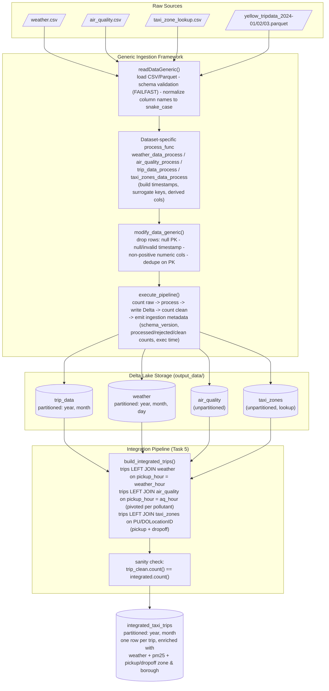

# Architecture Diagram

Diagram of the data platform implemented in `data_ingestion.py`: raw source files flow through the generic ingestion framework, dataset-specific transformation rules, and Delta Lake storage, then are combined by the integration pipeline into `integrated_taxi_trips`.

## Reading the diagram

- **Raw Sources → Generic Ingestion Framework**: every dataset, regardless of format (CSV or Parquet), passes through the same three generic stages — schema-validated read + name normalization, dataset-specific transformation, then generic data-quality filtering/deduplication — before being timed and written by `execute_pipeline`.
- **Delta Lake Storage**: each cleaned dataset lands as its own Delta table under `output_data/`, partitioned according to the strategy in Task 2 (`weather` and `trip_data` are the only partitioned tables; `air_quality` and `taxi_zones` are not).
- **Integration Pipeline**: `trip_data` is the anchor table. All enrichment (weather, air quality, pickup/dropoff zone and borough) is attached via `left` joins keyed on the trip's pickup hour or location IDs, so no trip is ever dropped or duplicated — verified by the row-count sanity check before the result is written to `integrated_taxi_trips`.
